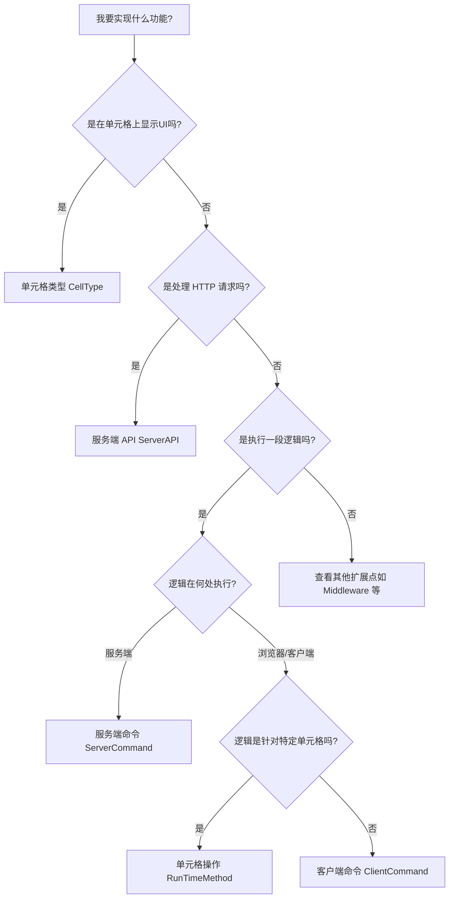

# 活字格插件开发标准作业程序 (SOP) —— 简洁版

本 SOP 旨在提供高效、标准化的开发流程，确保插件的“简洁与安全”。

## 阶段一：环境与初始化 (Setup)
1. **环境检查**：安装 .NET SDK (6.0+) 及活字格设计器。
2. **项目创建 (强制)**：
   - **必须**运行 `scripts/init_project.ps1` 启动构建器。
   - **严禁**手动创建项目结构或使用 `dotnet new`。
3. **项目配置**：用户确认创建完成后，运行 `scripts/init_project.ps1` （原 setup_project 功能已合并）配置 Logo 和依赖。
4. **产出**：获取包含 `.csproj` 和基础代码的项目结构。

## 阶段二：需求分析与计划 (Planning)
1. **工具盘点**：在开始前，检查 `scripts/` 目录下是否有可用的辅助工具（如 `generate_logo.py`）。
2. **创建计划**：在 `plans/` 下创建 `序号_需求描述.md`。
2. **内容要求**：
   - **分析**：明确目标。
   - **引用**：必须链接至 `references/` 中的规范文档。
   - **设计**：规划属性与核心逻辑。
3. **确认**：用户确认计划后方可开始编码。

## 阶段三：定义与属性设计 (Design)
1. **类型决策**：根据以下决策逻辑选择最适合的插件类型：

**决策说明**：
- **CellType**：在单元格上显示自定义UI控件、图表、复杂交互组件
- **ServerAPI**：提供自定义HTTP接口供外部系统调用
- **ServerCommand**：后端逻辑处理、数据库操作、文件读写
- **ClientCommand**：纯前端逻辑、页面跳转、浏览器API调用
- **RunTimeMethod**：针对特定单元格的客户端操作
- **Middleware**：拦截请求、全局异常处理、自定义认证逻辑

2. **属性定义**：
   - 遵循 `references/Unified_Properties.md`。
   - 必须使用 `[DisplayName]`。
   - 布尔值默认 True 时必须加 `[DefaultValue(true)]`。
3. **极简 API**：严禁暴露内部参数，优先内部推导。

## 阶段四：核心实现 (Implementation)
1. **依赖预检 (Dependency Pre-check)**：
   - 在编写代码前，若计划使用非 BCL (Base Class Library) 类库（如 `Newtonsoft.Json`），**必须**先检查 `.csproj` 文件。
   - 若未引用，必须在生成代码前调用 `dotnet add package <PackageName>`。
2. **服务端 (C#)**：
   - 数据库：强制使用 `this.Context.DataAccess` + 参数化查询。
   - 日志：使用 `this.Context.Logger`，禁止 `Console.WriteLine`。
3. **前端 (JS)**：
   - **同步约束**：生命周期方法严禁 `async`。
   - **逻辑复用**：提取数据转换纯函数，确保 `onRender` 与 `updateData` 一致。
   - **物理拆分与模块化**：对于大型项目，禁止将所有逻辑挤在单个 JS 文件中。应按功能（工具类、工厂类、主类）进行物理拆分，并通过 `PluginConfig.json` 的 `javascript` 数组严格控制加载顺序（底层工具先加载，业务逻辑后加载）。
   - **交互幂等性 (Idempotency)**：在执行昂贵的 UI 操作（如重绘、重置）前，**必须**进行状态对比。如果输入参数未发生变化，应直接跳过操作，防止内存泄漏 and 不必要的性能损耗。
   - **埋点**：带有 `[PluginName]` 前缀的日志记录。

## 阶段五：构建与维护 (Build & Maintenance)
1. **构建**：严格遵循 `references/Build_Standard.md`，在项目根目录执行 `dotnet build`（无参数）。
   - **注意**：默认生成 Debug 版本。
2. **验证**：在设计器安装并测试功能，检查 F12 控制台日志。
3. **代码维护 (Refactoring)**：
   - **API 迁移**：使用 `grep` 或 `Find` 定位旧接口（如 `IGenerateContext`），进行小步替换与验证。
   - **清理**：删除类文件后必须清理 `PluginConfig.json` 中的无效引用。
   - **修复**：若引用丢失，运行 `scripts/update_references.ps1`。

## 阶段六：发布与市场 (Publishing)
1. **市场资料准备**：
   - **模板**：基于 `assets/templates/Market_Description_Template.md` 创建上架文档。
   - **同步**：
     - 检查 `PluginConfig.json` 确保插件 ID/名称与市场信息一致。
     - **图标一致性检查**：确保 `PluginConfig.json` 的 `"image"` 字段引用的文件（如 `PluginLogo.png`）与 `[Icon]` 特性使用的图标在视觉上保持一致。
     - 从 `README.md` 提取最新的功能描述。
   - **生成**：填充模板中的占位符（包括版本、作者、截图链接），确保文档符合葡萄城市场规范。
2. **最终打包**：
   - **执行**：运行 `dotnet build`（严禁添加 `-c Release`）。
   - **交付**：取 `bin/Debug/<TargetFramework>/` 下的 zip 包。
